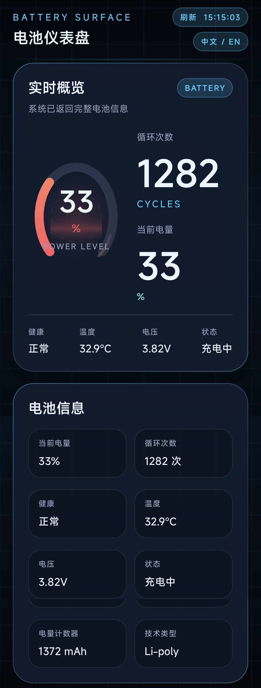
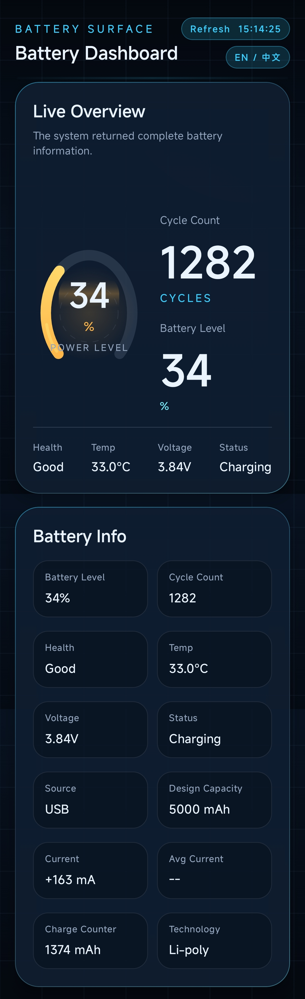

# Cycle Pulse

[中文](#中文) | [English](#english)

## 中文

### 项目简介

Cycle Pulse 是一个基于 Jetpack Compose 构建的 Android 电池仪表盘应用，使用全屏科技风界面展示系统公开的实时电池信息。

### 项目预览



### 功能特性

- 实时显示电池循环次数
- 实时显示当前电量、温度、电压、健康状态
- 显示充电状态、供电方式、设计容量、电流、电量计数器等信息
- 每秒自动刷新电池数据
- 连接/断开充电器时显示 3 秒自动消失的科技风提示
- 提供中文 / 英文界面切换
- 全屏仪表盘 UI，包含圆形电量仪表和轻量扫描动画

### 技术栈

- Kotlin
- Jetpack Compose
- Material 3
- Android `BatteryManager`
- `BATTERY_CHANGED` 广播

### 数据来源

应用只使用 Android 系统公开接口获取电池信息：

- `BATTERY_CHANGED` 广播
- `BatteryManager` 属性接口
- `PowerProfile#getBatteryCapacity()` 反射读取设计容量

其中电池循环次数优先来自：

- `android.os.extra.CYCLE_COUNT`

### 兼容性说明

- 电池循环次数通常需要 Android 14 及以上系统才可能公开
- 即使系统版本满足要求，不同 ROM 或驱动也可能不会提供 `CYCLE_COUNT`
- 电流方向和数值精度依赖设备底层实现，设备之间可能存在差异

### 构建方式

Debug：

```bash
./gradlew :app:assembleDebug
```

Release：

```bash
./gradlew :app:assembleRelease
```

### APK 输出

- Debug: `Cycle Pulse-debug.apk`
- Release: `Cycle Pulse-release.apk`

---

## English

### Overview

Cycle Pulse is an Android battery dashboard built with Jetpack Compose. It presents public real-time battery information through a full-screen futuristic UI.

### Preview



### Features

- Real-time battery cycle count display
- Real-time battery level, temperature, voltage, and health status
- Charging status, power source, design capacity, current, and charge counter
- Automatic refresh every second
- Custom sci-fi charger connect/disconnect notification that closes automatically after 3 seconds
- Built-in Chinese / English language switching
- Full-screen dashboard UI with a circular battery gauge and lightweight scan animation

### Tech Stack

- Kotlin
- Jetpack Compose
- Material 3
- Android `BatteryManager`
- `BATTERY_CHANGED` broadcast

### Data Sources

The app only uses public Android system interfaces:

- `BATTERY_CHANGED` broadcast
- `BatteryManager` property APIs
- Reflection on `PowerProfile#getBatteryCapacity()` for design capacity

Battery cycle count is primarily read from:

- `android.os.extra.CYCLE_COUNT`

### Compatibility Notes

- Battery cycle count is usually only available on Android 14+
- Even on supported Android versions, some ROMs or drivers may not expose `CYCLE_COUNT`
- Current direction and precision depend on the device-specific battery driver implementation

### Build

Debug:

```bash
./gradlew :app:assembleDebug
```

Release:

```bash
./gradlew :app:assembleRelease
```

### APK Outputs

- Debug: `Cycle Pulse-debug.apk`
- Release: `Cycle Pulse-release.apk`
